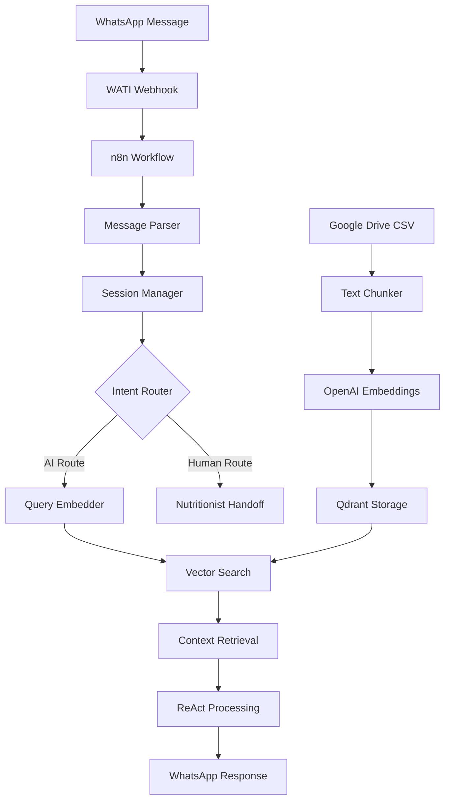

# 🤖 Nutritalk - WhatsApp RAG Assistant

> **Pragmatic AI solution that reduced customer response time from 4-5 hours to 4 seconds for Youvit's nutrition support**


## 🎯 Project Overview

Nutritalk is a WhatsApp-based AI assistant built for Youvit (Indonesia's leading gummy vitamin brand) using RAG technology. The system provides instant, accurate nutritional guidance, automating 70-80% of customer inquiries that previously required human nutritionist intervention.

### ⚡ Impact Achieved

- **Response Time**: 4-5 hours → 4 seconds (99.98% improvement)
- **Availability**: Business hours → 24/7 coverage
- **Automation Rate**: 70-80% of inquiries handled autonomously
- **Accuracy**: 98% (only 2 hallucinations per 100 messages)
- **Cost**: $8.50/month operational expense

## 🚀 The Problem & Solution

### **The Challenge**

Youvit had only **2 nutritionists** handling repetitive customer inquiries 24/7, preventing them from focusing on strategic brand ambassador activities. Customers waited 4-5 hours for responses to common questions about product safety, dosage, and ingredients.

### **The Pivot**

Initial Django web app failed due to user friction. **Key insight**: Meet customers where they already are - WhatsApp, Indonesia's most popular messaging platform.

### **The Solution**

Built a pragmatic RAG system using visual tools instead of custom development, prioritizing user adoption over technical sophistication.

## 🏗️ Technical Architecture



## 🔧 Tech Stack

| Component            | Technology             | Purpose                                  |
| -------------------- | ---------------------- | ---------------------------------------- |
| **Workflow Engine**  | n8n                    | Visual automation (7-day development)    |
| **Vector Database**  | Qdrant (free tier)     | Knowledge storage & retrieval            |
| **LLM**              | OpenAI GPT-4o          | Response generation with ReAct prompting |
| **Embeddings**       | text-embedding-3-small | Cost-effective semantic search           |
| **WhatsApp API**     | WATI.io                | Business messaging integration           |
| **Session Store**    | Redis                  | User session management                  |
| **Knowledge Source** | Google Drive CSV       | Three-category knowledge base            |

## 📊 ReAct Prompting Implementation

### **Think → Evaluate → Review → Deliver Process**

```javascript
// Example: "Apakah vitamin gummy aman untuk ibu hamil?"

THOUGHT: Need pregnancy safety information for gummy vitamins
ACTION: Search knowledge base for "vitamin gummy pregnancy safety"
OBSERVATION: Found general pregnancy guidelines, need specific data
THOUGHT: Search for Youvit-specific safety information
ACTION: Search "Youvit products pregnancy safe ingredients"
OBSERVATION: Found specific product safety profiles
FINAL RESPONSE: [Comprehensive pregnancy safety guidance]
```

## 🏛️ Knowledge Architecture

### **Three-Category System**

1. **General Information**: Basic health guidance
2. **Product Knowledge**: Youvit-specific details
3. **Ingredients & Benefits**: Nutritional science

### **Multi-Category Retrieval**

Smart information combination - simple questions trigger comprehensive responses covering related products, nutrients, and health benefits.

## 📈 Performance Metrics

| Metric              | Before         | After     | Improvement      |
| ------------------- | -------------- | --------- | ---------------- |
| **Response Time**   | 4-5 hours      | 4 seconds | 99.98%           |
| **Availability**    | Business hours | 24/7      | 100%             |
| **Automation**      | 0%             | 70-80%    | New capability   |
| **Daily Inquiries** | 10-15          | 10-15     | Same volume      |
| **Escalations**     | 100%           | 20-30%    | 70-80% reduction |

## 💰 Cost Structure

**Monthly Operational Costs:**

- n8n hosting: $5 USD
- OpenAI API: $3.50 USD
- **Total: $8.50 USD/month**

**Business Value:**

- 60% time savings for nutritionist team
- 24/7 customer coverage without additional staff
- Consistent information delivery
- Scalable support without linear cost increase

## 🛠️ Setup Instructions

### Prerequisites

- n8n instance (cloud or self-hosted)
- Qdrant account (free tier)
- OpenAI API key
- WATI WhatsApp Business account
- Redis instance
- Google Drive with CSV knowledge base

### Installation

1. **Import n8n workflow** from the provided JSON file
2. **Configure credentials** for all external services
3. **Set up knowledge base** by running the embedding workflow once
4. **Configure WhatsApp webhook** to point to your n8n endpoint
5. **Test the complete flow** with sample messages

### Environment Variables

```bash
OPENAI_API_KEY=your-openai-key
QDRANT_URL=your-qdrant-instance
QDRANT_API_KEY=your-qdrant-key
WATI_TOKEN=your-wati-token
REDIS_URL=your-redis-connection
```

## 📋 System Components

### **Knowledge Embedding Layer**

- CSV data ingestion from Google Drive
- Text chunking (512 tokens, 50 overlap)
- Vector embedding generation
- Qdrant storage with metadata

### **Message Logic Layer**

- WhatsApp webhook handling
- Session management with Redis (30min TTL)
- Intent analysis and routing decisions
- Human handoff for complex queries

### **Retrieval Layer**

- Query embedding generation
- Multi-category vector search
- Context aggregation and formatting
- ReAct-powered response generation

## 🔍 Quality Control

### **Built-in Safeguards**

- Prompt injection protection
- Automatic escalation triggers
- Self-evaluation checkpoints
- Conversation memory management

### **Escalation Triggers**

- Keywords: "bicara dengan ahli gizi", "talk to nutritionist"
- Complex medical queries beyond product scope
- Product quality complaints
- Collaboration/sponsorship requests

## 📚 Key Learnings

### **Technical Insights**

- **Platform accessibility > technical sophistication**
- **Visual tools enabled 7-day development cycle**
- **User experience trumps cutting-edge technology**
- **Local context crucial for adoption (WhatsApp in Indonesia)**

### **Business Lessons**

- Meet customers where they already are
- Pragmatic solutions often outperform sophisticated systems
- Focus on solving real problems, not showcasing technology
- Rapid iteration enables quick market validation

## 📊 Project Timeline

**Development: 7 Days**

- Day 1-2: Knowledge base structure
- Day 3-4: RAG implementation
- Day 5-6: ReAct prompting & quality control
- Day 7: Security & escalation features

**Production: 3 Months**

- Excellent customer sentiment
- 98% accuracy maintained
- Ended due to company efficiency measures (not product failure)

## 🔮 Future Enhancement Ideas

If rebuilt today, could include:

- Multimodal capabilities (voice, image)
- Customer analytics dashboard
- Persistent user personalization
- Proactive engagement features

## 🤝 Project Impact

### **Organizational**

- Foundation for automation initiatives across Youvit
- Normalized AI adoption within company
- Template for future customer service innovations

### **Technical**

- Demonstrated ROI of pragmatic AI implementation
- Proof that visual tools can deliver enterprise results
- Bridge between technical capabilities and business needs

---

## 💡 Core Takeaway

> "The important things is the solutions that we brings was solved the problems and run smoothly as expected, its no matter about the tech stack, the framework, the programming language. I just realize that in real business case we need to be pragmatic."

**Success Framework:**

1. Understand the real problem (not the technical challenge)
2. Choose familiar platforms over cutting-edge technology
3. Optimize for user adoption first, features second
4. Iterate quickly with working solutions
5. Measure business impact, not technical metrics

---

**Built for Youvit Indonesia** | _Pragmatic AI that works_
