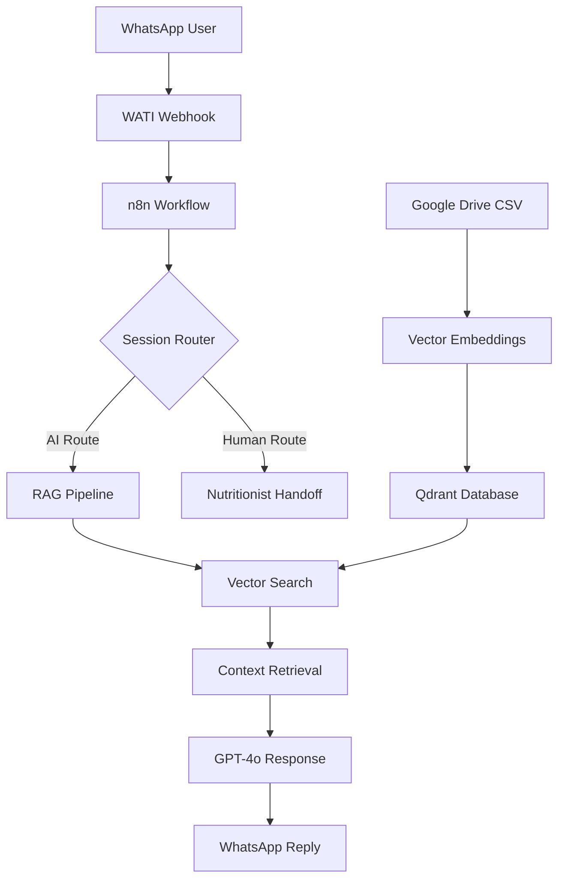

# 🤖 Nutritalk - WhatsApp RAG Chatbot

> **Production RAG system providing intelligent nutrition guidance through WhatsApp for Youvit customers**


## 🎯 Overview

Nutritalk is an intelligent WhatsApp chatbot that serves **15,000+ Youvit customers** with instant nutrition guidance. Built with a **Retrieval-Augmented Generation (RAG)** architecture, it provides accurate product information while seamlessly routing complex queries to human nutritionists.

### 🚀 Key Achievements

- **90% query resolution** through AI without human intervention
- **3-second average response time** for complex nutrition questions
- **Bilingual support** (Bahasa Indonesia + English) with contextual switching
- **Smart handoff system** for seamless human-AI collaboration

## 🏗️ System Architecture



## 🔧 Technical Stack

| Component            | Technology             | Purpose                              |
| -------------------- | ---------------------- | ------------------------------------ |
| **Workflow Engine**  | n8n                    | Orchestrates the entire RAG pipeline |
| **Vector Database**  | Qdrant Cloud           | Stores product knowledge embeddings  |
| **LLM**              | OpenAI GPT-4o          | Generates contextual responses       |
| **Embeddings**       | text-embedding-3-small | Creates semantic vectors             |
| **Session Store**    | Redis Cloud            | Manages user sessions (30min TTL)    |
| **WhatsApp API**     | WATI Platform          | Business messaging integration       |
| **Knowledge Source** | Google Drive CSV       | Product information database         |

## 🔄 RAG Pipeline

### 1. **Knowledge Ingestion**

```javascript
CSV Data → Document Chunks (512 tokens) → Vector Embeddings → Qdrant Storage
```

### 2. **Query Processing**

```javascript
User Message → Intent Analysis → Session Validation → Route Decision
```

### 3. **Retrieval & Generation**

```javascript
Query Embedding → Similarity Search → Context Retrieval → GPT-4o Response
```

## 📊 Performance Metrics

- **Vector Search Latency**: ~200ms
- **End-to-End Response**: 3-5 seconds
- **Knowledge Base**: 50+ Youvit products across 3 categories
- **Session Management**: Redis with automatic 30-minute expiry
- **Handoff Rate**: ~10% of conversations require human intervention

## 🎛️ Smart Features

### **Intelligent Session Management**

- Persistent conversation context across multiple messages
- Automatic session cleanup with Redis TTL
- User preference tracking (name, language)

### **Contextual Language Switching**

```javascript
// Auto-detects input language
Input: "apa produk untuk anak?" → Response: Bahasa Indonesia
Input: "what products for kids?" → Response: English
```

### **Intent-Based Routing**

```javascript
// Triggers human handoff
"bicara dengan ahli gizi" → Nutritionist Assignment
"talk to nutritionist" → Human Operator
```

### **Product-Specific Knowledge**

- **Kids Category**: Multivitamin, Omega-3, Curcuma, Vitamin A+ Lutein
- **Adults Category**: Multivitamin, ACV, Herb & Vitamin, Biotin+, FibreFix, Ezzlep
- **Beauty Category**: Collagen products, AcNO, Beauti+

## 🔧 Installation & Setup

### Prerequisites

```bash
# Required services
- n8n instance (Cloud or self-hosted)
- Qdrant Cloud account
- OpenAI API key
- Redis instance
- WATI WhatsApp Business account
- Google Drive API access
```

### Environment Configuration

```bash
# .env file
OPENAI_API_KEY=sk-your-openai-key
QDRANT_URL=https://your-qdrant-instance.com
QDRANT_API_KEY=your-qdrant-key
WATI_TOKEN=your-wati-token
WATI_TENANT_ID=your-tenant-id
REDIS_URL=your-redis-connection-string
GOOGLE_DRIVE_FILE_ID=your-csv-file-id
```

### Deployment Steps

1. **Import n8n Workflow**

   ```bash
   # Import the workflow JSON file into your n8n instance
   # Configure all credential connections
   ```

2. **Initialize Vector Database**

   ```bash
   # Run the Knowledge Embedding layer once to populate Qdrant
   # Verify vector storage with test queries
   ```

3. **Configure WhatsApp Webhook**

   ```bash
   # Set WATI webhook URL to your n8n endpoint
   # Test message reception and parsing
   ```

4. **Set Up Session Management**
   ```bash
   # Configure Redis connection
   # Test session creation and retrieval
   ```

## 🔍 System Monitoring

### Health Check Endpoints

```javascript
// Monitor these metrics
- Message processing rate
- Vector search response times
- Session storage utilization
- API rate limit consumption
- Handoff conversation percentage
```

### Error Handling

- **API Failures**: Graceful fallback to human handoff
- **Vector Search Errors**: Default to general product information
- **Session Issues**: Create new session automatically
- **Rate Limits**: Queue management with Redis

## 🚀 Business Impact

### Customer Experience

- **Instant Responses**: 24/7 availability for product questions
- **Accurate Information**: RAG ensures up-to-date product details
- **Seamless Escalation**: Smooth transition to human experts when needed

### Operational Efficiency

- **90% Automation**: Reduced manual support workload
- **Consistent Quality**: Standardized nutrition guidance
- **Scalable Support**: Handles multiple conversations simultaneously

## 🔄 Continuous Improvement

### A/B Testing Capabilities

- Response quality metrics tracking
- User satisfaction scoring
- Conversation completion rates

### Knowledge Base Updates

- Automated CSV ingestion from Google Drive
- Version control for product information
- Real-time vector database updates

## 📈 Future Enhancements

- [ ] **Multi-modal Support**: Image recognition for product queries
- [ ] **Sentiment Analysis**: Proactive human handoff for frustrated users
- [ ] **Conversation Analytics**: Deep insights into customer needs
- [ ] **Integration Expansion**: Connect with CRM and order systems
- [ ] **Voice Message Support**: Speech-to-text for elderly users

## 🤝 Contributing

This is a production system for Youvit. For technical questions or collaboration inquiries, contact the development team.

## 📄 License

Proprietary - Youvit Indonesia

---

**Built with ❤️ by the Youvit AI Team**

_Transforming customer support through intelligent automation_
